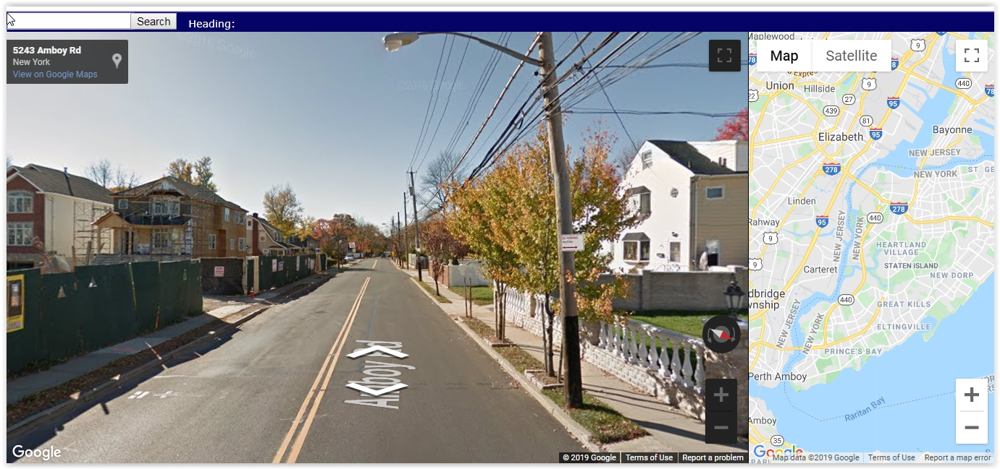
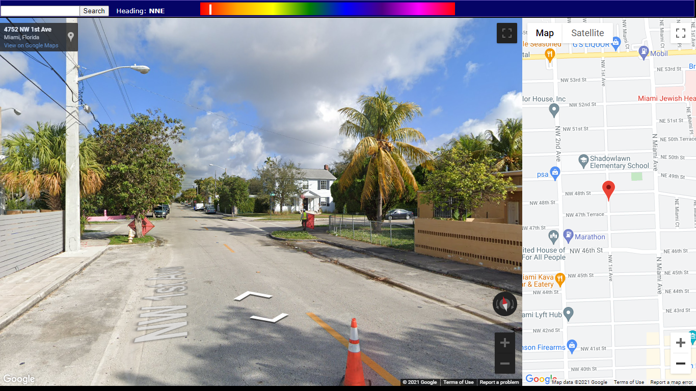

# Google Street View API

Primitive addition to the Google Street View API to play around with this years back.

Here's what this could do.

1. Since this is ultra lightweight, it seems faster
2. You can click anywhere in the map and the change reflects in the street view panel
3. Best part, if you click a number, it will move you in those amount of steps.

# UPDATE SEPTEMBER 2021!!!!!!!!!

PRIMITIVE NO MORE!!!!!!!! I added much more features to this to navigate this much better & efficiency with little clicking & handwork as possible (It preserves the mouse for longer). It also makes the experience far more pleasurable.

When clicking on the map, the compass direction automatically points to the direction from the previous location to the next location. I did not come up with the Math code to do this, I luckily got it from Stack Overflow to save lots of time.

Also, there's a rainbow bar above that can change the compass direction just by hovering over the rainbow bar on the top, rather than clicking! 

I changed the background from white to black for the panes & elements to blend in better.

I did this to make looking at future new locations/hometowns for myself much better.

This is so much better than the existing Street View (probably faster with no ads), as well as the first version of this program!

